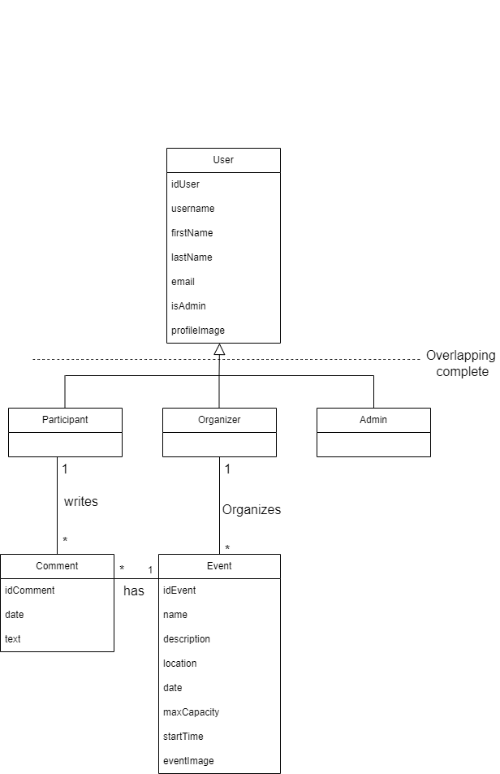
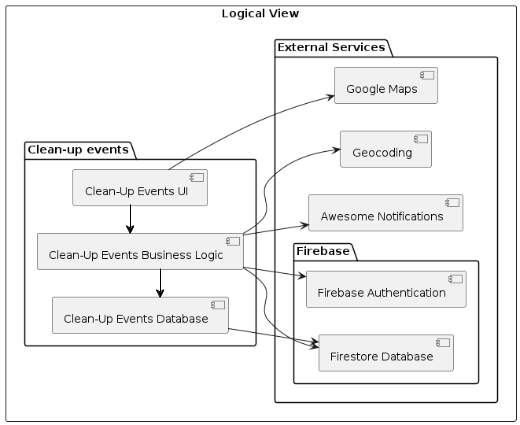
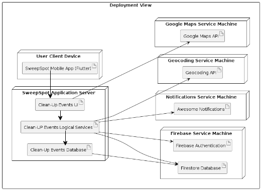
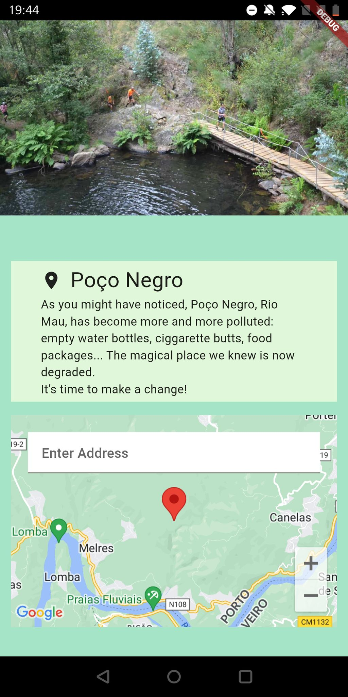
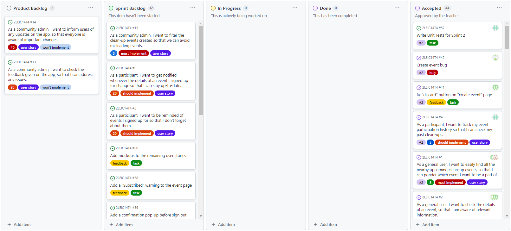
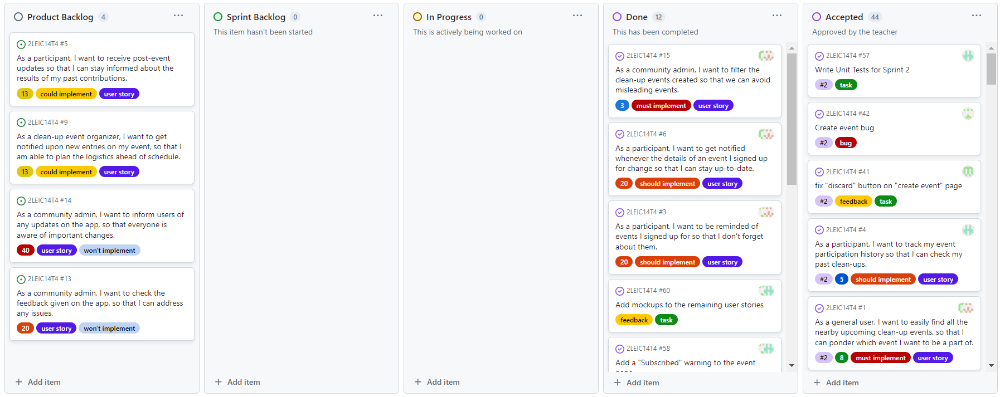

# SweepSpot Development Report

Welcome to the documentation pages of the SweepSpot!

You can find here details about the SweepSpot, from a high-level vision to low-level implementation decisions, a kind of Software Development Report, organized by type of activities: 

* [Business modeling](#Business-Modelling) 
  * [Product Vision](#Product-Vision)
  * [Features and Assumptions](#Features-and-Assumptions)
  * [Elevator Pitch](#Elevator-pitch)
* [Requirements](#Requirements)
  * [User stories](https://github.com/FEUP-LEIC-ES-2023-24/2LEIC14T4/issues)
  * [Domain model](#Domain-model)
* [Architecture and Design](#Architecture-And-Design)
  * [Logical architecture](#Logical-Architecture)
  * [Physical architecture](#Physical-Architecture)
  * [Vertical prototype](#Vertical-Prototype)
* [Project management](#Project-Management)

 * Miguel Fernandes - up202207547@up.pt
 * Pedro Marinho - up202205693@up.pt
 * Pedro Gonçalo Oliveira - up202208345@up.pt
 * Rui Xavier Silva - up202207183@up.pt
 * Tomás Vinhas - up202208437@up.pt

---
## Business Modelling

### Product Vision
For environmentally-conscious individuals who actively seek a sustainable living through community engagement, SweepSpot is an eco-friendly community app that is designed to smooth the path of organizing and joining local clean-up events. Unlike other event management apps, our product focuses solely on environmental initiatives.

### Features, Assumptions, and Dependencies

#### Features
- **Built-in map functionality:** Integrated Google Maps to display event locations.
- **Notification API:** Utilizes Awesome Notifications for sending and managing notifications within the app.
- **Register/Login to personal accounts:** Authentication and user management via Firebase Authentication.
- **Reset Email/Password:** Reset account email and password through Firebase.
- **Profile Setup and Editing:** Create and modify user profiles.
- **Feature Organize:** Create and manage a clean-up event.
- **Feature Participate:** Join a local clean-up event.
- **Event Management:** Create, edit, and delete clean-up events.
- **View Events:** See future and past events.
- **Leave Comments:** Post comments on clean-up events.
- **Event History:** View personal history of clean-up event participation (visible only to the user).

#### Assumptions
- Users have internet access to interact with the app's features and services.

#### Dependencies
- **Google Maps API:** Provides map functionalities to visualize event locations.
- **Geocoding API:** Converts addresses into geographical coordinates for mapping.
- **Firebase Authentication:** Manages user registration, login, and authentication.
- **Firestore Database:** Stores and syncs data related to users and events.
- **Awesome Notifications:** Manages notifications for event reminders and updates.

### Elevator Pitch
"Alguma vez estiveram num parque ou numa praia e viram lixo espalhado pelo chão? E sentiram aquela frustração de querer fazer algo mas não saber por onde começar?
O SweepSpot é a solução para todos nós que queremos um mundo mais limpo. É uma aplicação comunitária e ecológica, desenhada para quem procura uma vida sustentável através do envolvimento local. Com o SweepSpot, qualquer pessoa pode inscrever-se e organizar eventos de limpeza na sua área com facilidade.
Ao contrário de outras apps de gestão de eventos, focamo-nos exclusivamente em iniciativas ambientais. Queremos simplificar o processo de unir pessoas para limpar e cuidar do nosso planeta. O SweepSpot ajuda-te a encontrar eventos de limpeza perto de ti e a conectar-te com outros que partilham a mesma paixão pela sustentabilidade.
Junta-te a nós no SweepSpot e torna-se parte de uma comunidade empenhada em fazer a diferença. Juntos, vamos criar um impacto positivo e visível, uma limpeza de cada vez. Vamos transformar frustração em ação e cuidar do nosso ambiente. Obrigado."

## Requirements

### Domain model
 * The generalization User is an aggregation of all types of users;
 * A participant is an user that can join an event and can write comments on the event page;
 * An organizer is the user that created one or more events;
 * An admin is an user that has privileged permissions i.e. can delete an event or comment;
 * The event can have multiple participants, but can only have 1 organizer. Also, when the event can have multiple comments by the participants;
 * Each comment is associated with an event, and each comment is written by a single participant.

 

  

## Architecture and Design
### Logical architecture
SweepSpot’s logical architecture is divided into two main packages:
	
* Clean-up events:
    * Clean-Up Events UI: Handles user interactions and shows the clean-up event information.
    * Clean-Up Events Business Logic: It includes all of the work done in the background, such as creating events and interacting with the database.
    * Clean-Up Events Database: Helps to store and manage data from any cleanup event.

* External Services:
    * Google Maps: Provides built-in map functionality that allows the visualization of the location of an event.
    * Geocoding: Converts event addresses into geographical coordinates so as to come up with markers on the map.
    * Firebase:
      * Firebase Authentication: Manages user authentication and security.
      * Firestore Database: A NoSQL database for storing and syncing data in real-time.

Awesome Notifications: Manages notifications for the application.

This design also includes the internal notification function in Clean-Up Events Business Logic that allows interactions with the user and to share information about events.
 

  

### Physical architecture
SweepSpot’s physical architecture is divided into 4 main components:

 * User Client Device: The mobile device running the SweepSpot mobile app developed using the Flutter framework..

 * SweepSpot Application Server: Hosts the server-side parts of the SweepSpot application.

    * Clean-UP Endpoint: Provides an endpoint for communication between the user client device and the server.

    * Clean-UP Events Logical Services: Contains all the business logic and functionalities associated with clean-up events.

    * Clean-Up Events Database: Stores and manages clean-up event data.

 * Google Maps Service Machine: It has Google Maps service which provides map functionality.

    * Google Maps API: It enables integration with the Google Maps service to display event locations.

 * Geocoding Service Machine: It has geocoding service responsible for converting addresses into geographical coordinates.

    * Geocoding API: Converts event addresses to map markers.
  
  * Firebase Service Machine: Provides authentication and database services.

    * Firebase Authentication: Manages user authentication and security.
    * Firestore Database: A NoSQL database for storing and syncing data in real-time.

  * Notifications Service Machine: Handles the delivery and management of notifications for the application.

    * Awesome Notifications: Service used within the application to trigger and display notifications to users.

 

  

### Vertical prototype
As of now, we have implemented part of the event page. While the description, image and name of an event are static (cannot be changed), there is a search box where any address input is transformed into coordinates that allow the map to display a marker in the exact place chosen. 

 

	

> [Figma Mockup Link](https://www.figma.com/file/MYwjG4VTrNZHUPxUqd8MXw/Untitled?type=design&node-id=0-1&mode=design&t=GF5UeLXExQjuznil-0)

### Project management
> You can find below information and references related with the project management in our team:
* **Backlog Management:** Product backlog and Sprint backlog can be found in our [Github Projects board](https://github.com/orgs/FEUP-LEIC-ES-2023-24/projects/49).
* **Changelog:** View the project's [changelog](CHANGELOG.md) for details about each release.
* **Retrospective Notes:** Meeting notes for sprint retrospectives can be found in [Retrospective Notes](RETROSPECTION.md).
* **Feedback and Product Backlog:** Sprint Review feedback and relevant Product Backlog modifications are available on [Feedback](FEEDBACK.md)

### Sprint 3:
* Beginning of the iteration:

	

	
	

  

  <b><i>Sprint 3 Initially</i></b>
  

* End of the iteration:

	

	
	

  

  <b><i>Sprint 3 Finally</i></b>
  

  
   
   

* Version list:
  - [v0](https://github.com/FEUP-LEIC-ES-2023-24/2LEIC14T4/releases/tag/v0)
  - [v1](https://github.com/FEUP-LEIC-ES-2023-24/2LEIC14T4/releases/tag/v1)
  - [v2](https://github.com/FEUP-LEIC-ES-2023-24/2LEIC14T4/releases/tag/v2.0)
  - [v3](https://github.com/FEUP-LEIC-ES-2023-24/2LEIC14T4/releases/tag/v3.0)
### Notes
Credentials to log into an existing account:
 - email: pedrogoncaloliveira@gmail.com
 - password: password123
